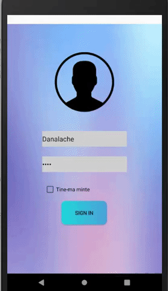
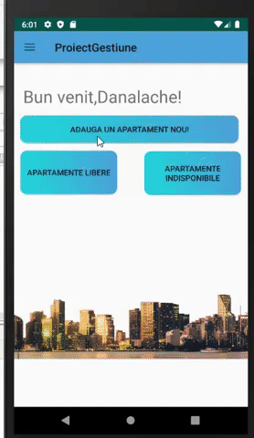

<h1 align="center">Mobile application for rent management</h1>

<h3>Description</h3>
A real estate agency has the responsibility to satisfy the client's needs by offering quality services and guiding him to the right choice of a home that will satisfy his needs.

By implementing the rent management application, the activities undertaken by the staff of a real estate rental company can be more easily observed and performed by digitizing, organizing and storing data in a database.
Thus, for their support I created multiple functionalities such as: <em>apartment management, details about clients, contracts with clients taken from a JSON file, monthly profit calculation functions, company expenses by connecting to Firebase and so on.</em>

The first complex functionality is that of the management of the apartments in the patrimony of the real estate agency which are divided into two categories: available apartments and occupied apartments. By implementing this filter, employees will be able to provide customers with only the available apartments, along with details about them. Also, they will be able to change the condition of the apartment from available to occupied.
Also, if the company decides to make an investment in purchasing a new apartment, it can be entered by default in the list of apartments available for rent.

<h3 align="center">For more details about the application feel free to clone.</h3>
<h3>Characteristics:</h3>
<ol>
<li>Defining populated activities / fragments using appropriate visual controls.</li>
<li>Using various controls (Button, TextView, EditView, CheckBox, Spinner, ProgressBar...)</li>
<li>Creating a data entry form.</li>
<li>Transfer of parameters between activities/fragments.</li>
<li>Implement custom adapters.</li>
<li>Stylizing the mobile application.</li>
<li>Use of classes for access to external resources.</li>
<li>Processing complex JSON files containing at least 3 nodes arranged on different levels.</li>
<li>Use shared preferences files.</li>
<li>Creating an SQLite database and implementing DDL operations.</li>
<li>Implementing DML operations (Room library)</li>
<li>Using remote databases (Firebase) (save / restore)</li>

</ol>

<h3>Opening:</h3>
 
Run the application. The access is done by entering the username "Danalache" and the password "1234".